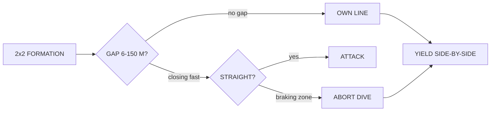
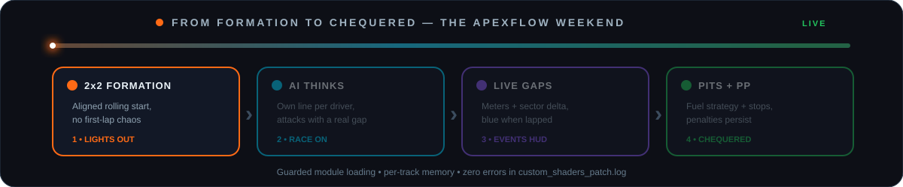

<div align="center">

<br>
<a href="https://github.com/Silxyst/ApexFlow"></a>

<p>
<a href="https://github.com/Silxyst/ApexFlow/releases/latest"></a>


<a href="https://github.com/Silxyst/ApexFlow/blob/master/LICENSE"></a>
</p>

<p>


</p>

<p><strong>Human-like AI and Race Control for Assetto Corsa.</strong><br>2 lightweight apps: ApexFlow Core + ApexFlow Events HUD.<br>Thinking AI • Clean 2×2 starts • Live delta gaps • Persistent penalty points.</p>

<p><a href="#-why-apexflow">Why ApexFlow?</a> • <a href="#-features">Features</a> • <a href="#-race-weekend">Race weekend</a> • <a href="#-installation">Installation</a> • <a href="#-configuration">Configuration</a> • <a href="#-quick-start">Quick Start</a> • <a href="#-api">API</a> • <a href="#-faq">FAQ</a> • <a href="#-roadmap">Roadmap</a></p>
</div>

> 🏁 **TL;DR:** grab the zip from [releases](https://github.com/Silxyst/ApexFlow/releases/latest), extract into `Assetto Corsa/apps/lua/`, enable both apps in Content Manager — and go racing.

## 🎯 Why ApexFlow?

> **AI that thinks instead of crashing.** Every driver has a personality, picks its own line, brakes progressively into slow corners, and only attacks on straights with a real gap — no kamikaze dives, no train formation.

- 🪶 **Lightweight:** 10 modules • 3 windows • zero errors in `custom_shaders_patch.log`
- 🔌 **Offline-first:** no online dependencies, per-track `ApexFlow_config.lua` auto-save
- 🏁 **2 apps:** `ApexFlow` core (`1024×760` + setup) + `ApexFlow Events` HUD overlay (`360×260`)
- 🌧️ **Rain-aware:** grip logic desensitized in the wet, AI keeps its pace instead of crawling
- 🚩 **No conflicts:** flags and track limits are handled by AC itself — no double penalties

## ✨ Features

| System | What it does | Where |
|---|---|---|
| 🧠 **Thinking AI** | `Chill / Normal / Attack` mix (0–100, try 65–70) • 5-class multiclass support • attacks only on straights with a 6–150 m gap and closing speed • aborts dives before braking zones • own line per driver, yields side-by-side in corners | `Drivers` tab |
| 🏁 **Race and Starts** | Aligned 2×2 rolling formation • adaptive fuel strategy with mandatory stops • real pit speed limit • endurance presets (Sprint → 24h) | `Race` tab |
| 📏 **Live gaps** | Gap to leader in meters • gap + time delta to the car behind (blue when lapped) • per-sector delta, wrap-safe | `Events` HUD |
| 📊 **Penalty points** | L1 = 1 PP … L6 = 6 PP, persisted across sessions via `ac.storage` | `Events` HUD |
| ☁️ **Extras** | GitHub update checker • per-track learning memory • lap telemetry CSV | `System` tab |

### How the AI thinks



## 🎬 Race weekend



## 📦 Installation

**Requirements:** `Assetto Corsa` + `Custom Shaders Patch 0.3.0+` + `Content Manager` + offline session.

1. Download `ApexFlow_v0.34.0.zip` from [releases/latest](https://github.com/Silxyst/ApexFlow/releases/latest)
2. Extract into `Assetto Corsa/apps/lua/` (creates/updates the `ApexFlow/` folder)
3. Content Manager → Apps → enable `ApexFlow` + `ApexFlow Events`
4. In AC → Apps sidebar → `ApexFlow`

<details>
<summary><strong>📁 Package contents (v0.34.0)</strong></summary>

```
ApexFlow/
├─ manifest.ini (3 windows: main, setup, events)
├─ ApexFlow.lua (core loop, guarded safeRequire loading)
├─ icon.png
├─ sfx/rs_beep.wav
└─ src/
   ├─ ai_controller.lua  (thinking race AI)
   ├─ gap_behind.lua     (gap + delta + lapped flag)
   ├─ github_update.lua  (release checker)
   ├─ lang.lua           (PT/EN/ES translations)
   ├─ memory.lua         (per-track memory)
   ├─ penalty_severity.lua (persistent PP)
   ├─ race_strategy.lua   (adaptive fuel)
   ├─ rolling_start.lua  (aligned 2x2)
   ├─ sector_gaps.lua    (sector delta)
   └─ ui.lua             (5 tabs)
```
</details>

## ⚙️ Configuration

Settings auto-save to `ApexFlow_config.lua` (per track). Five tabs in the main app:

| Tab | Controls |
|---|---|
| **Home** | Live gaps, penalty points, session info |
| **Drivers** | `Profile Mix` 0–100 (68 ≈ 2–3 cars fighting) + pace pack |
| **Race** | Rolling start `limitSpeed/gap` + strategy `laps/stops` + real pit limit |
| **Screen** | HUD toggles (`gapBehind/deltaLive`), progress bars, blink |
| **System** | GitHub updates, accent theme |

## 🏎️ Quick Start

**First race (2 minutes):**

1. `Drivers → Profile Mix 68` + `Pace 55`
2. `Race → Rolling ON` + `Strategy 20 laps / 1 stop`
3. Green flag — watch the Events HUD: `P3 | Lap 2 | 12 m behind P4 +1.2 s | PP 0`

**Rain:** nothing to configure — the AI automatically desensitizes grip sliding and keeps its rhythm instead of crawling.

**Backmarkers:** the car behind shows **blue** when lapped, with time delta.

**Penalty points:** `PP 3 · L3` persists across qualifying and race — check `Events`.

## 🛠️ API

```lua
_G.APEXFLOW_API.getGapBehindState()      -- {gapBehindM, gapBehindKm, carBehindPos, deltaBehind, isLappedBehind}
_G.APEXFLOW_API.getSectorGapsState()     -- {gapSectorM, gapSectorS, currentSector}
_G.APEXFLOW_API.getPenaltySeverityState()-- {totalPP, level, lastReason, history}
_G.APEXFLOW_API.getStrategyState(cfg)    -- {nextPit, stopsLeft, fuelPerLap}
```


## 🙋 FAQ

<details>
<summary>🌧️ Do I need to configure anything for rain?</summary>
<br>
No. Grip logic desensitizes automatically in the wet and the AI keeps its pace instead of crawling.
</details>

<details>
<summary>🚩 Will it conflict with AC penalties or other apps?</summary>
<br>
No. Flags and track limits stay with Assetto Corsa itself, so there are no double penalties.
</details>

<details>
<summary>🌍 How do I change the language?</summary>
<br>
Use the language selector in the app UI. PT, EN and ES are supported out of the box.
</details>

<details>
<summary>📊 Do penalty points survive between sessions?</summary>
<br>
Yes. Points persist across sessions via <code>ac.storage</code> — a <code>PP 3 · L3</code> in qualifying is still there in the race.
</details>

<details>
<summary>🔔 How do I know when a new version drops?</summary>
<br>
The built-in GitHub update checker watches releases and tells you inside the <code>System</code> tab.
</details>

## 🗺️ Roadmap

- [x] `v0.34.0` i18n PT/EN/ES (UI+HUD, language selector, ES 88% + PT fallback)
- [x] `v0.33.1` Panel window removed too — back to Principal + Events
- [x] `v0.33.0` WEB removed (panel_server, panel.html, webui)
- [x] `v0.32.2` GitHub auto-update on new CSP + repo migration
- [x] `v0.31.2` Smooth race lines (±0.30 cap, no mid-corner crossing) + progressive slow-corner braking
- [x] `v0.30.0` New Race Logic AI: thinks before passing, no trains, no kamikaze
- [x] `v0.29.3` Rain grip fix + persistent PP + delta gaps
- [x] `v0.28.1` Lightweight 2-app split
- [ ] Helicorsa-style radar + graphical telemetry CSV
- [ ] Season championship with PP standings

## 📄 License

MIT — **Silxyst**. Free for personal and commercial use, see [LICENSE](LICENSE).

<div align="center">

<sub>ApexFlow v0.34.0 — 2 apps • 10 modules • CSP 0.3.0 • zero errors • PT/EN/ES</sub><br>
<sub>Built with ❤️ for the Assetto Corsa community · <a href="#-race-weekend">back to top ↑</a></sub>
</div>